## Este repositorio esta hecho con el fin de entrenar la exploración de datos, utilicé como guía el  cuaderno de kaggle [Comprehensive data exploration with Python](https://www.kaggle.com/code/pmarcelino/comprehensive-data-exploration-with-python/notebook#4.-Missing-data) y  [House Prices - Advanced Regression Techniques](https://www.kaggle.com/competitions/house-prices-advanced-regression-techniques) y también de paso traducirlo para practicar mi ingles jeje


#### Nuestra tarea es predecir el precio de venta de cada casa. Para cada Id en el conjunto de prueba, debes predecir el valor de la variable SalePrice.

#### Para hacer el análisis, es necesario tener instalada la API de kaggle, en caso de no tenerla, la instalamos desde la terminal con:
````python
pip install kaggle
````
#### Ahora para poder descargar los datos, debemos descargar el archivo kaggle.json, desde la configuración de nuestra cuenta de Kaggle, y una vez descargado lo movemos hacia la carpeta .kaggle
#### Movemos el archivo usando
````python
move ~/downloads/kaggle.json ~/.kaggle/
````

#### Ya con el archivo en la carpeta, descargamos el dataset
````python
kaggle competitions download -c house-prices-advanced-regression-techniques
````
#### Movemos el archivo ZIP a nuestra carpeta deseada, en mi caso estoy guardando en mi carpeta Onedrive. Si quieres una ubicación distinta solo tienes que reemplazar la dirección por la que quieras. 
````python
move ~/downloads/house-prices-advanced-regression-techniques.zip ~/onedrive/Data/
````
#### Y extraemos el archivo ZIP,
````bash
Expand-Archive -Path ~/onedrive/Data/house-prices-advanced-regression-techniques.zip -DestinationPath ~/onedrive/Data/

# Eliminar el archivo zip después de la extracción

````
#### Se extraerán los siguientes archivos
````bash
├── Data/
│   ├── train.csv  # Archivo CSV extraído con los datos de entrenamiento
│   ├── test.csv   # Archivo CSV extraído con los datos de prueba
│   ├── sample-submission.csv  # Ejemplo de archivo de envío
│   └── data_description.txt  # Descripción de los datos

````
#### Ya extraídos los archivos, leemos el archivo CSV para tener los datos, para esto importaremos todo lo importante

````python
import pandas as pd
import matplotlib.pyplot as plt
import seaborn as sns
import numpy as np
from scipy.stats import norm
from sklearn.preprocessing import StandardScaler
from scipy import stats
import warnings
warnings.filterwarnings('ignore')
````
#### Ahora si, leemos el archivo y mostramos las columnas

````python
df_train = pd.read_csv('~/onedrive/Data/train.csv')
print(df_train.coumns)
````
#### Esto nos muestra todas las columnas del dataset, ya que, con esto podemos hacernos una idea de cuales son las columnas que tienen mayor impacto en el precio de venta

````bash
Index(['Id', 'MSSubClass', 'MSZoning', 'LotFrontage', 'LotÁrea', 'Street',
       'Alley', 'LotShape', 'LandContour', 'Utilities', 'LotConfig',
       'LandSlope', 'Neighborhood', 'Condition1', 'Condition2', 'BldgType',
       'HouseStyle', 'OverallQual', 'OverallCond', 'YearBuilt', 'YearRemodAdd',
       'RoofStyle', 'RoofMatl', 'Exterior1st', 'Exterior2nd', 'másVnrType',
       'másVnrÁrea', 'ExterQual', 'ExterCond', 'Foundation', 'BsmtQual',
       'BsmtCond', 'BsmtExposure', 'BsmtFinType1', 'BsmtFinSF1',
       'BsmtFinType2', 'BsmtFinSF2', 'BsmtUnfSF', 'TotalBsmtSF', 'Heating',
       'HeatingQC', 'CentralAir', 'Electrical', '1stFlrSF', '2ndFlrSF',
       'LowQualFinSF', 'GrLivÁrea', 'BsmtFullBath', 'BsmtHalfBath', 'FullBath',
       'HalfBath', 'BedroomAbvGr', 'KitchenAbvGr', 'KitchenQual',
       'TotRmsAbvGrd', 'Functional', 'Fireplaces', 'FireplaceQu', 'GarageType',
       'GarageYrBlt', 'GarageFinish', 'GarageCars', 'GarageÁrea', 'GarageQual',
       'GarageCond', 'PavedDrive', 'WoodDeckSF', 'OpenPorchSF',
       'EnclosedPorch', '3SsnPorch', 'ScreenPorch', 'PoolÁrea', 'PoolQC',
       'Fence', 'MiscFeature', 'MiscVal', 'MoSold', 'YrSold', 'SaleType',
       'SaleCondition', 'SalePrice'],
      dtype='object')
````
#### Para conocer las variables que más impacto tienen en el precio de venta, recomiendo leer el archivo de texto de descripción de las variables, esta categorización e imporatncia se vuelve más intuitiva después de algunos comandos, como:
````python
corrmat=df_train.corr()
corrmat["SalePrice"].sort_values(ascendig=False).head(10)
````

````bash
SalePrice       1.000000
OverallQual     0.790982
GrLivArea       0.708624
GarageCars      0.640409
GarageArea      0.623431
TotalBsmtSF     0.613581
1stFlrSF        0.605852
FullBath        0.560664
TotRmsAbvGrd    0.533723
YearBuilt       0.522897
````

### Teniendo en cuenta esta información, armaremos un mapa de calor de una matriz de correlación pero esta vez para observar la correlación de todas las variables, esto con el fin de evaluar la selección de variables.

````python
# Calculamos la matriz de correlacion con las variables de cols transponiendo primero los datos para que cada variable sea una fila
cm = np.corrcoef(df_train[cols].values.T)
sns.set(font_scale=0.9)
# Armamos el mapa de calor
hm = sns.heatmap(cm, cbar=True, annot=True, square=True, fmt='.2f', annot_kws={'size': 11}, yticklabels=cols.values, xticklabels=cols.values)
plt.title('Matriz Precio de Venta')
plt.tight_layout()
plt.show()
````
#### Así se deberia de ver
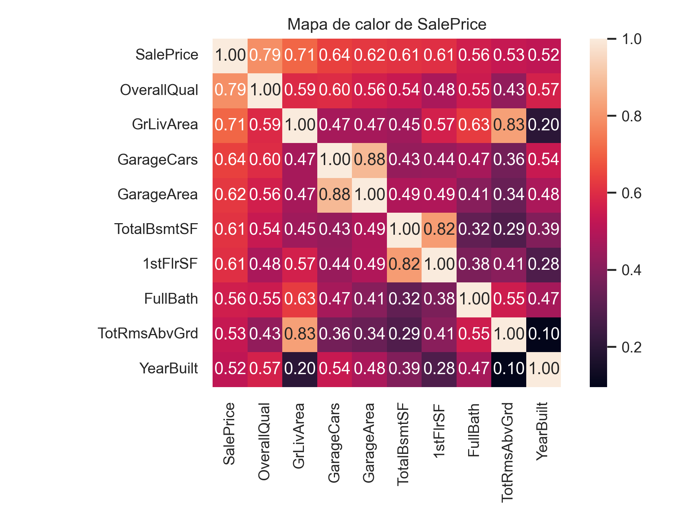

#### Las variables de "Garage" las vemos entre las más correlacionadas, pero el número de autos que caben en garaje es una consecuencia del Área del garaje. Por lo tanto, solo necesitamos una de estas variables en nuestro analísis. Podemos mantener "GarageCars" ya que según el mapa de calor, su correlación es más alta respeto al precio de venta.

#### Sucede lo mismo con la variable de "TotalBsmtSF" y "1stFloor", por lo que mantenemos solo "TotalBsmtSF". Y también lo mismo con "TotRmsAbvGrd" y "GrLivÁrea"

#### FullBath y YearBuilt también se destacan como variables con una correlación significativa con el precio de venta. 


### Por ultimo, haremos un scatterplot usando seaborn de todas las posbiles relaciones que podriamos tener en nuestro dataset con las variables

#### Declaramos sns.set para tener la visualizacion por defecto
````python
sns.set()
# Definimos las columnas que más nos interesaron, y quitamos las que son hermanas
cols = ['SalePrice', 'OverallQual', 'GrLivArea', 'GarageCars',
       'TotalBsmtSF', 'FullBath', 'YearBuilt']
# Armamos nuestra grafica
sns.pairplot(df_train[cols], size=2.5)
plt.title('Correlaciones Precio de Venta')
plt.tight_layout()
plt.show()
````

#### Se ve así

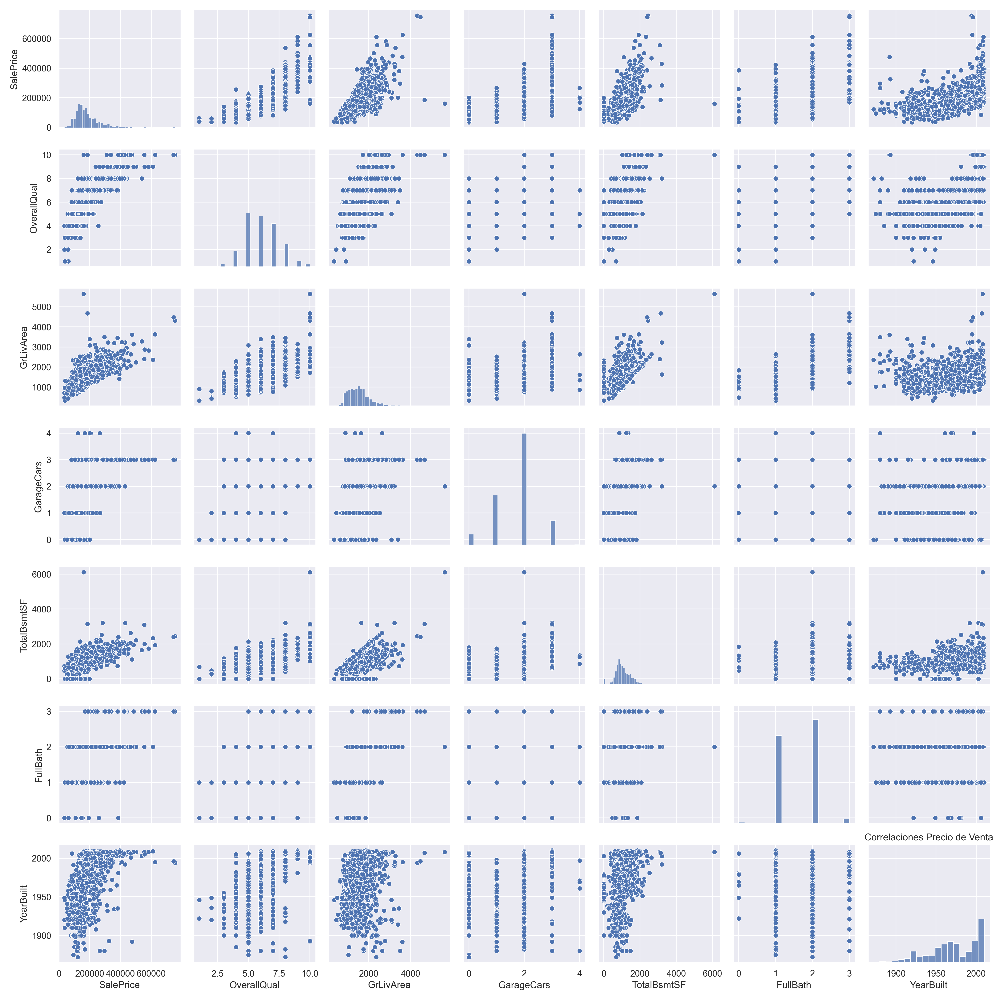

#### A simple vista notamos que la calidad general y el Área habitable son los factores que más influyen en el precio de venta de las viviendas.


### Por lo tanto, analizaremos las estadísticas descriptivas de la variable que nos interesa, la de precio de venta de la casa y observar como se comportan estas variables.

````python 
print(df_train["SalePrice"].describe())
````

````bash
count      1460.000000
mean     180921.195890
std       79442.502883
min       34900.000000
25%      129975.000000
50%      163000.000000
75%      214000.000000
max      755000.000000
Name: SalePrice, dtype: float64
````
#### Armaremos una grafica para observar la distribución del precio de venta, lo haremos usando histplot.

````python
plt.figure(figsize=(10, 6))  # Tamaño de la figura
sns.histplot(df_train['SalePrice'], kde=True, color='Blue', bins=30, edgecolor="none")  # Ajusta color y número de bins
plt.title('Distribucion de SalePrice')
plt.grid(True)  # Agrega una cuadrícula para una mejor visualización
plt.tight_layout() # Ajustar los márgenes y el espacio entre las subgráfiacas
plt.show()
````

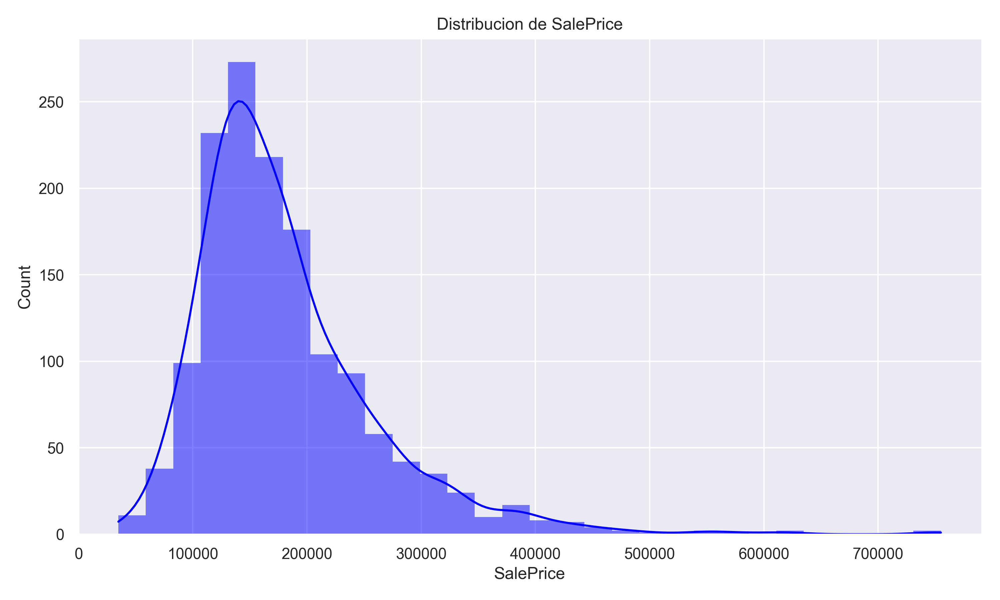

#### Podemos notar que se desvía de la distribución normal
#### La distribución esta inclinada hacia a la izquierda, lo que significa que hay una cola más larga en el lado derecho. Esto sugiere que hay una mayor cantidad de precios de viviendas que estan por debajo del promedio, y precios muy altos que estan por encima.
#### Vemos una "altitud" alta, lo que indica que hay una concentración notable de precios de venta en ciertos rangos


### Ahora examinemos una de las variables que tiene mayor impacto en el precio de venta, la cual es el Calidad General, lo haremos con caja de bigotes.

````python
var = 'OverallQual'
data = pd.concat([df_train['SalePrice'], df_train[var]], axis=1)
# Guaradmos los resultados, y definimos la nueva figura. F y AX es la figura y los ejes 
f, ax = plt.subplots(figsize=(8, 6))
# Definimos FIG como una variable donde haremos un sns.boxplot para guardar la grafica
fig = sns.boxplot(x=var, y="SalePrice", data=data, palette="Set2")
fig.axis(ymin=0, ymax=800000) #Definimos el eje FIG.AXIS
plt.title('Distribucion de SalePrice/OverallQual')
plt.tight_layout()
plt.grid(True)

````

#### Y así queda nuestro grafico de  caja de bigotes
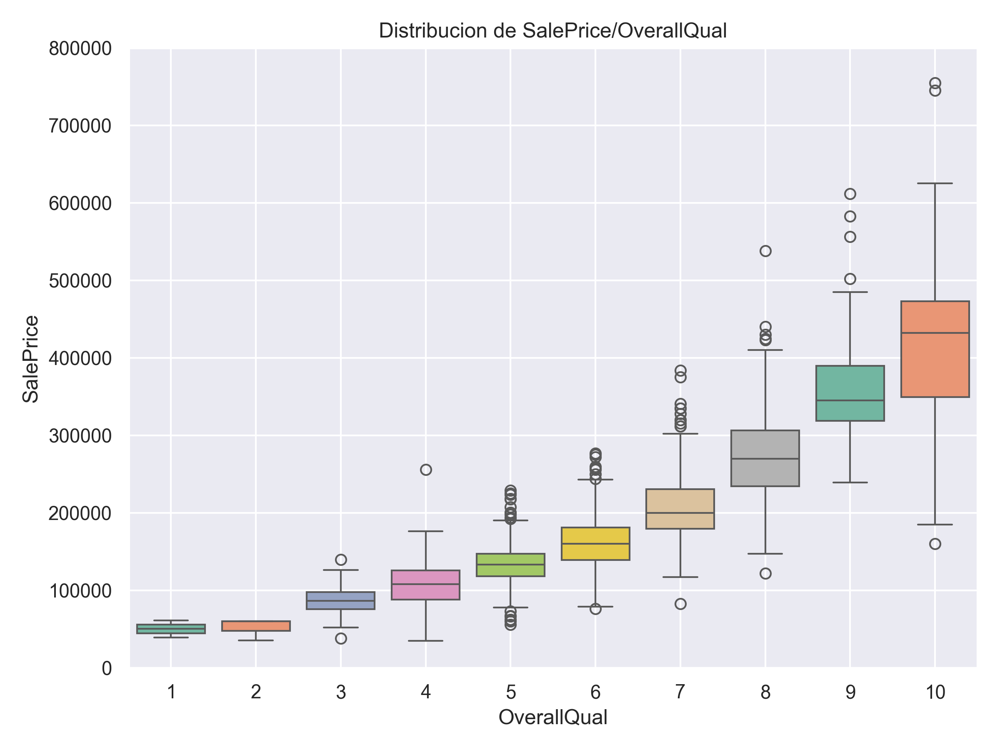

#### Vemos una relación positiva, esto es evidente por el incremento de las medianas en cada caja.
#### En los grupos vemos una variabilidad, esto indica que otros factores estan influyendo en el precio.


### Continuamos con el área habitable
````python
var = 'GrLivArea' # Se declara la variable que contiene el Área vivible
data = pd.concat([df_train['SalePrice'], df_train[var]], axis=1)# usamos pd.concat para crear una tabla de 2 columnas
data.plot.scatter(x=var, y='SalePrice', ylim=(0,800000))# Terminamos con un data.plot.scatter para crear la grafica
plt.title('Distribucion de SalePrice/GrLivarea')
plt.grid(True)  # Agrega una cuadrícula para mejor visualización
plt.tight_layout()
plt.show()
````

#### Así queda la grafica


#### Podemos ver una clara relación lineal entre el área habitable y el precio de venta. A medida que el área habitable aumenta, el precio de venta también tiende a aumentar. Esto confirma la hipótesis de que las casas más grandes generalmente se venden a precios más altos

### Seguimos con GarageCars

````python
var = 'GarageCars'
data = pd.concat([df_train['SalePrice'], df_train[var]], axis=1)
# Guaradmos los resultados, y definimos la nueva figura. F y AX es la figura y los ejes 
f, ax = plt.subplots(figsize=(8, 6))
# Definimos FIG como una variable donde haremos un sns.boxplot para guardar la grafica
fig = sns.boxplot(x=var, y="SalePrice", data=data, palette="Set2")
fig.axis(ymin=0, ymax=800000) #Definimos el eje FIG.AXIS
plt.title('Distribucion de SalePrice/GarageCars')
plt.tight_layout()
plt.grid(True)
plt.show()
````
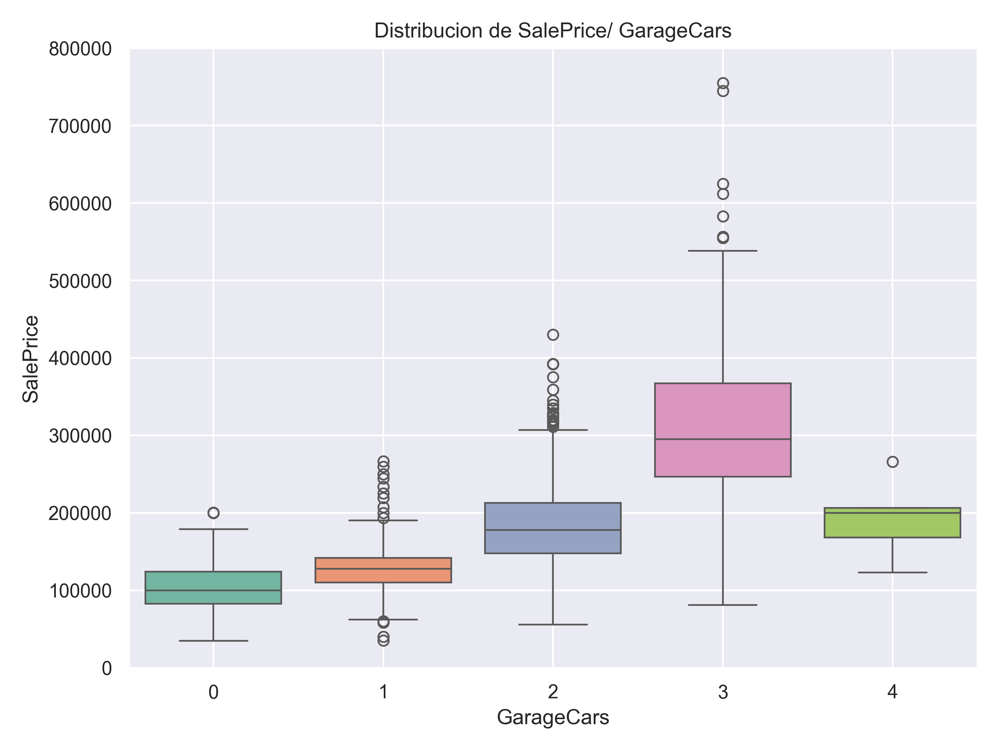

#### El precio de venta, es más alto para las casas con garajes que pueden albergar más coches. Esto refuerza la idea de que las casas con más espacio para garaje son más caras.


### Seguimos con el área del sotano

````python
var = 'TotalBsmtSF'
data = pd.concat([df_train['SalePrice'], df_train[var]], axis=1)
data.plot.scatter(x=var, y='SalePrice', ylim=(0,800000))
plt.title('Distribucion de SalePrice/TotalBsmtSF')
plt.grid(True)
plt.tight_layout()
plt.show()
````
#### Nos queda así


#### Notamos una tendencia positiva entre las variables. Es decir, a mayor tamaño del sotano, mayor es el precio de venta de la propiedad. 
#### La dispersión de datos indica que aunque hay una tendencia general, existen variaciones. Hay propiedad con sótanos de menor tamaño que se venden por precios altos y viceversa.


### Seguimos con Baño completo
````python
var = 'FullBath'
data = pd.concat([df_train['SalePrice'], df_train[var]], axis=1)

plt.figure(figsize=(10, 6))
sns.boxplot(x=var, y='SalePrice', data=data)
plt.title('Distribución de SalePrice/FullBath')
plt.grid(True)
plt.tight_layout()
plt.show()
````
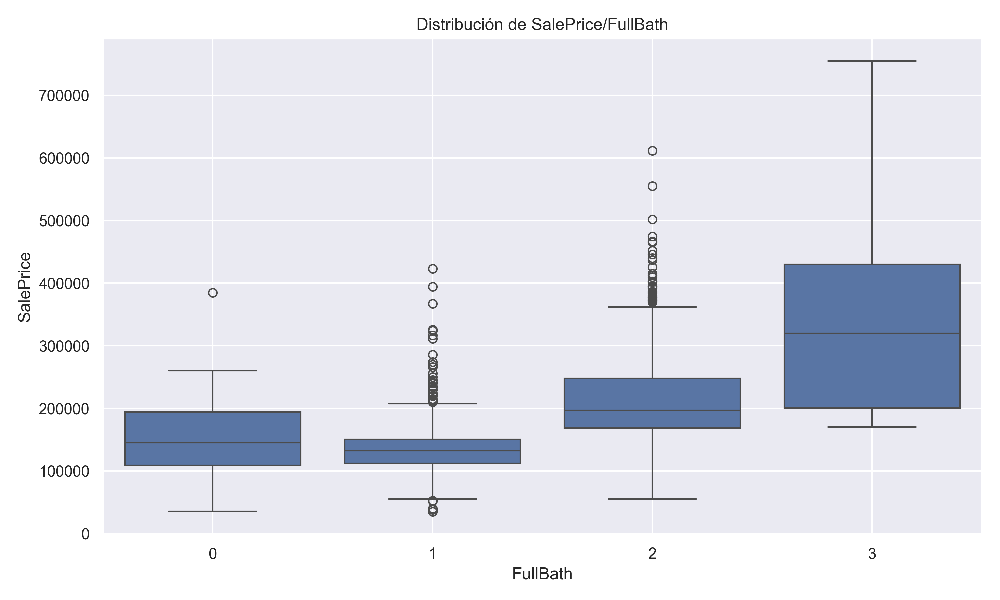

#### Las casas con 3 baños completos muestran tanto precios máximos más altos como una mayor dispersión, lo que podría estar relacionado con factores adicionales.


### Ahora haremos exactamente lo mismo pero con la variable de año de construcción

````python
var = 'YearBuilt'
data = pd.concat([df_train['SalePrice'], df_train[var]], axis=1)
f, ax = plt.subplots(figsize=(16, 8))
palette = sns.color_palette("viridis") 
fig = sns.boxplot(x=var, y="SalePrice", data=data, palette="PuRd")
fig.axis(ymin=0, ymax=800000)
plt.xticks(rotation=90)
plt.title('Distribucion de SalePrice/YearBuilt')
plt.tight_layout()
plt.show()
````

#### Nos queda algo así

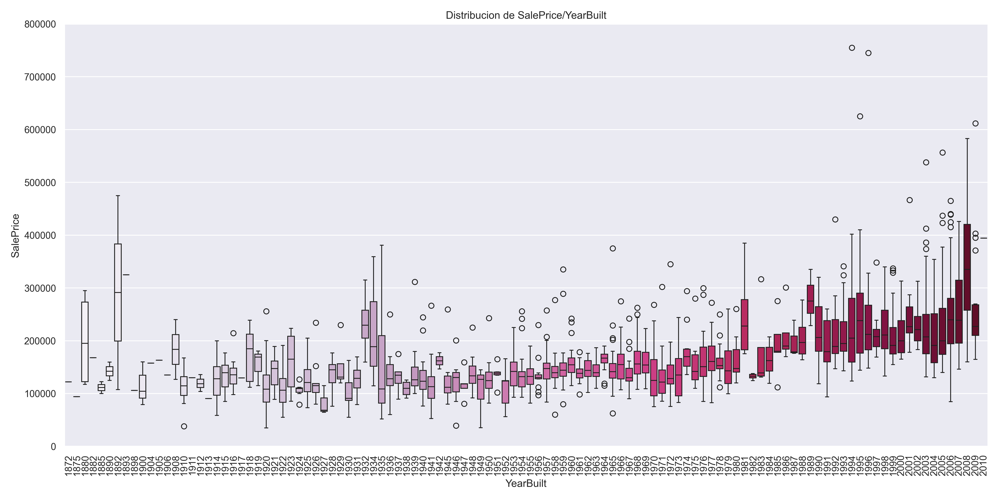

#### Se ve una tendencia ascendente en los precios de venta a medida que se acerca a la actualidad
### Resumiendo:
#### Área habitable y Área total del sotano, tienen una relación lineal con el precio de venta.

#### Las casas con más espacio de garaje tienden a tener precios de venta más altos.

#### Un mayor tamaño del sótano está correlacionado con un precio de venta más elevado, aunque hay mayor variabilidad en sótanos grandes.

#### Las casas con baños completos tienen precios más altos 
#### Calidad general y el año de construcción también tienen una relación con el precio de venta, siendo más fuerte la calidad general.


# Antes de seguir avanzado, sigamos con lo que falta, los datos faltantes.

### Dos preguntas importantes que debemos considerar
### ¿Cuál es la frecuencia de los datos faltantes?
### ¿Son los datos faltantes aleatorios o tienen un patrón?

#### Es crucial responder a estas preguntas porque los datos faltantes pueden reducir el tamaño de la muestra y obstaculizar el análisis. Además, debemos garantizar que el manejo de datos faltantes no introduzca sesgos ni oculte información importante.

### Datos faltantes

````python
total = df_train.isnull().sum().sort_values(ascending=False) # Idenfiticamos las celdas con valores faltantes en el dataframe con "True", y contamos el número total de valores faltantes.
percent = (df_train.isnull().sum()/df_train.isnull().count()).sort_values(ascending=False) # Dividimos el número de datos faltantes entre el número total de entradas. Esto da como resultado el porcentaje de datos faltantes
missing_data = pd.concat([total, percent], axis=1, keys=['Total', 'Percent']) # Unimos las dos series en un dataframe, alineando las columnas, y le asignamos los nombres.
print(missing_data.head(20)) #Mostramos
````

````bash
              Total   Percent
PoolQC         1453  0.995205
MiscFeature    1406  0.963014
Alley          1369  0.937671
Fence          1179  0.807534
másVnrType      872  0.597260
FireplaceQu     690  0.472603
LotFrontage     259  0.177397
GarageQual       81  0.055479
GarageFinish     81  0.055479
GarageType       81  0.055479
GarageYrBlt      81  0.055479
GarageCond       81  0.055479
BsmtFinType2     38  0.026027
BsmtExposure     38  0.026027
BsmtCond         37  0.025342
BsmtQual         37  0.025342
BsmtFinType1     37  0.025342
másVnrArea        8  0.005479
Electrical        1  0.000685
Condition2        0  0.000000
````

#### Si más del 15% de los datos de una variable están ausentes, la eliminamos. Variables como "PoolQC", "MiscFeature" y "Alley" serán descartadas.
#### Para variables "Garage", que tienen la misma cantidad de datos faltantes en el 5% de los casos, tambièn se eliminarán, ya que la información crucial se encuentra en "GarageCars". Lo mismo aplica con las variables "Bsmt"
#### "MasVnrÁrea" y "MasVnrType" tienen una alta correlación con "YearBuilt" y "OverallQual", por lo que su eliminación no afecta la calidad del análisis.
#### Finalmente, con solo una observación faltante en "Electrical", se eliminará esa observación y se mantendrá la variable.

### Sabiendo esto, eliminaremos todas las variables con datos faltantes, excepto la variable "Electrical", simplemente eliminaremos la observación con datos faltantes.
````python
df_train = df_train.drop((missing_data[missing_data['Total'] > 1]).index, axis=1) # Eliminamos columnas con más de 1 dato faltante


df_train = df_train.drop(df_train.loc[df_train['Electrical'].isnull()].index) # Eliminamos filas con datos faltantes en "Electrical"


dfnul = df_train.isnull().sum().max()  # Verificando que no haya datos faltantes
print(dfnul)
````
````bash
0
````
#### Esto nos confirma que no quedan datos faltantes.

### Y para mantener la calidad del modelo es necesario identificar los Outliers

#### Un outlier es un valor que se desvía significativamente del resto de los datos y puede influir de manera desproporcionada en los análisis. Para identificar estos valores, se bede definir un umbral que permita distinguir entre los valores normales y los valores atípicos. Una forma efectiva de hacerlo es a través de la estandarización de los datos.

#### La estandarización de datos implica transformar los valores de la variable para que tengan una media de 0, lo que quiere decir que el promedio de todos los valores de la variable será 0, y una desviación estandar de 1, osea que la variabilidad de los valores se ajusta de manera que la medida estándar de dispersión sea 1 

#### El siguiente script estandariza la variable "SalePrice" del Dataframe "df_train"


````python

saleprice_array = df_train['SalePrice'].values.reshape(-1, 1)

# Estandarizar 'SalePrice'
saleprice_scaled = StandardScaler().fit_transform(saleprice_array) # StandardScaler es una clase de scikit-learn para estandarizar 

# Se ordenan los valores estandarizados y solo escogemos los 10 valores más bajos y más altos de la distribución
low_range = saleprice_scaled[saleprice_scaled[:, 0].argsort()][:10] 
high_range = saleprice_scaled[saleprice_scaled[:, 0].argsort()][-10:]

# Imprimimos
print('Rango bajo de la distribución:')
print(low_range)
print('\nRango alto de la distribución:')
print(high_range)
````

````bash
Rango bajo de la distribución:
[[-1.83820775]
 [-1.83303414]
 [-1.80044422]
 [-1.78282123]
 [-1.77400974]
 [-1.62295562]
 [-1.6166617 ]
 [-1.58519209]
 [-1.58519209]
 [-1.57269236]]

Rango alto de la distribución:
[[3.82758058]
 [4.0395221 ]
 [4.49473628]
 [4.70872962]
 [4.728631  ]
 [5.06034585]
 [5.42191907]
 [5.58987866]
 [7.10041987]
 [7.22629831]]
````

##### Rango Bajo: Los valores en el rango bajo son similares y no están demásiado lejos de 0, osea que no hay valores extremadamente bajos que sean preocupantes.

##### Rango Alto: Los valores en el rango alto están significativamente lejos de 0, especialmente los valores alrededor de 7. Esto sugiere que hay algunos outliers muy altos que podrían influir en el análisis, por ahora se decide no eliminar estos outliers pero hay que ser cautelosos con esos valores de 7 y algo


### Ahora miremos desde una nueva perspectiva

````python
var = 'GrLivArea'
data = pd.concat([df_train['SalePrice'], df_train[var]], axis=1)
data.plot.scatter(x=var, y='SalePrice', ylim=(0,800000))
plt.show()
````

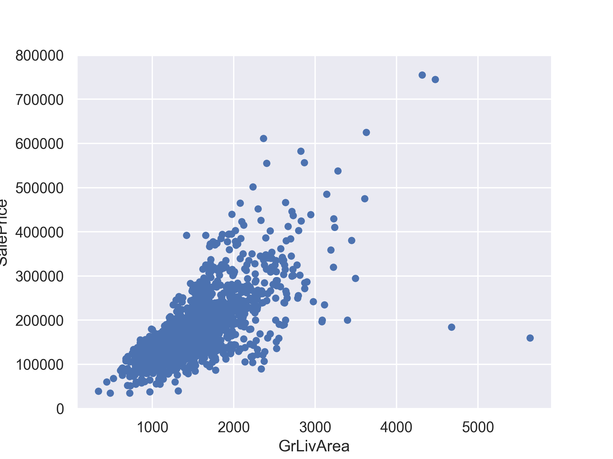

#### Podemos ver los dos valores más grandes de "GrLivÁrea", tal vez se refieran a un área agrícola, pero no estamos seguro de eso. Por lo tanto los eliminares

#### Los dos valores superiores de precio de venta son esos valores 7 y algo, si bien son casos de outlier, parecen seguir la tendencia. Por esa razón, no se eliminarán.

#### Si necesitamos saber especificamente cuales son esos puntos, podemos saberlo.
````python
print(df_train.sort_values(by = 'GrLivArea', ascending = False)[:2])
````
````bash
       Id  MSSubClass MSZoning  ...  SaleType SaleCondition SalePrice
1298  1299          60       RL  ...       New       Partial    160000
523    524          60       RL  ...       New       Partial    184750

````

#### Eliminamos los datos
````python
df_train = df_train.drop(df_train[df_train['Id'] == 1299].index)
df_train = df_train.drop(df_train[df_train['Id'] == 524].index)
````
#### Veamos como quedo
````python
var = 'GrLivArea'
data = pd.concat([df_train['SalePrice'], df_train[var]], axis=1)
data.plot.scatter(x=var, y='SalePrice', ylim=(0,800000))
plt.tight_layout()
plt.show()
````
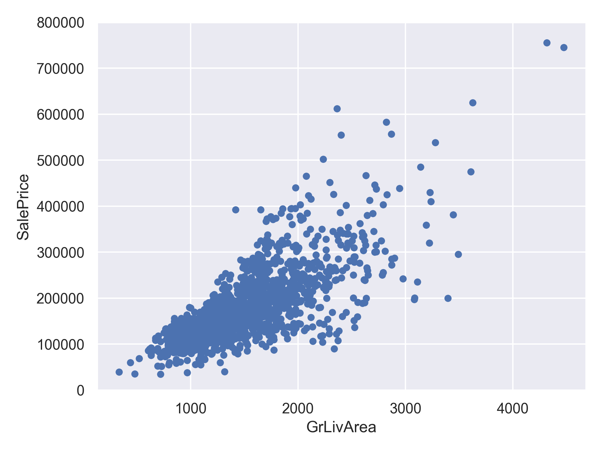


#### Repetimos con el área total del sotano

````python
var = 'TotalBsmtSF'
data = pd.concat([df_train['SalePrice'], df_train[var]], axis=1)
data.plot.scatter(x=var, y='SalePrice', ylim=(0,800000));
plt.show()
````
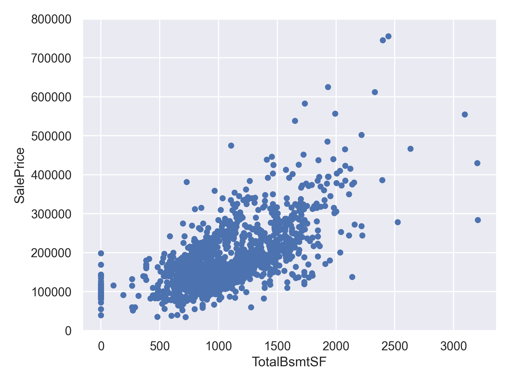

#### Podriamos sentir la necesidad de eliminar algunos valores como (TotalBsmtSF > 3000), pero no haremos nada, ya siguen la tendencia levemente.


## Ahora probraremos algunas suposiciones según Joseph F. Hair en su libro Multivariate Data Analysis (2013):

### -Normalidad
#### Queremos que los datos se parezcan a una distribución normal, ya que muchas pruebas estadísticas dependen de ello. Verificaremos la normalidad univariada para 'SalePrice'. Aunque esto no asegura la normalidad multivariada, ayuda y evita problemás como la heterocedasticidad.

### -Homoscedasticidad
#### Se refiere a la suposición de que las variables dependientes exhiben niveles iguales de varianza a lo largo del rango de variables predictoras

### -Linealidad
#### Se evalúa examinando gráficos de dispersión en busca de patrones lineales, si no son lineales, vale la pena explorar transformaciones de datos. Sin embargo, la mayoría de los gráficos que hemos visto tienen relaciones lineales por lo que no haremos esto.

### -Ausencia de Errores Correlacionados
#### Ocurre cuando un error está correlacionado con otro. Si detectamos esto, añadiremos una variable que explique el efecto.

### En la busqueda de la normalidad, el punto aquí es probar la variable del precio de venta. Haremos esto prestando atención a:

#### Histograma - Curtosis y asimetría.
#### Gráfico de probabilidad normal - La distribución de datos debería seguir de cerca la diagonal que representa la distribución normal.

````python
sns.distplot(df_train['SalePrice'], fit=norm);
fig = plt.figure() 
res = stats.probplot(df_train['SalePrice'], plot=plt)
plt.show()
````


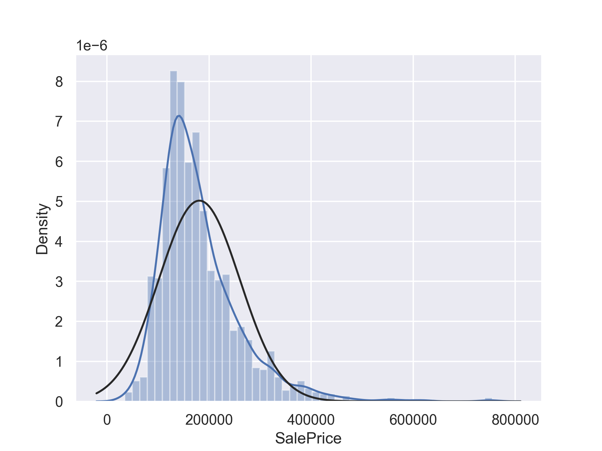
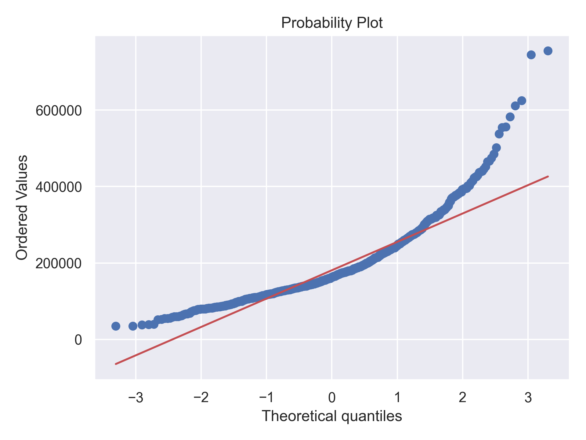


#### Es notable que la distribución de "SalePrice" no es normal. Muestra "peakedness" y curtosis positiva, además de no seguir la línea diagonal

#### Una transformación de datos puede resolver este problema, ya que en caso de curtosis positiva, las transformaciones logaritmicas funcionan bien. 

````python

df_train['SalePrice'] = np.log(df_train['SalePrice']) # se calcula el logaritmo natural (base e) de la variabe precio de venta, 
# y convierte cada valor de la variable al logaritmo natural de ese valor.
# Esto significa que la columna del precio de venta ahora contiene los valores transformados en lugar de los valores originiales


sns.distplot(df_train['SalePrice'], fit=norm); #Se crea un histograma de la variable precio de venta y se ajusta una distribución normal a modo de comparación visual
fig = plt.figure() 
res = stats.probplot(df_train['SalePrice'], plot=plt) # Se genera un grafico de probabilidad normal para precio de venta transformado, que compara la dsitribución de los datos con una distribución normal
plt.show() # Mostramos
````
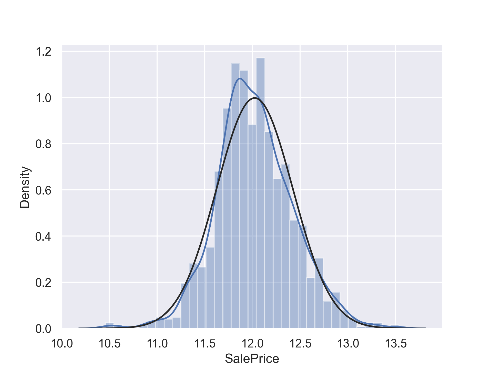
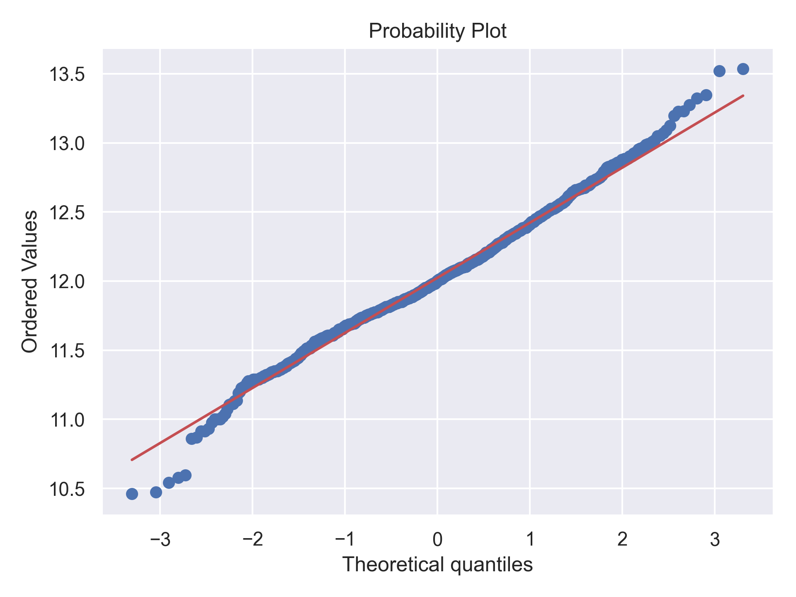


#### Seguimos con la variable de área habitable

````python

sns.distplot(df_train['GrLivArea'], fit=norm);
fig = plt.figure()
res = stats.probplot(df_train['GrLivArea'], plot=plt)
plt.show()
````
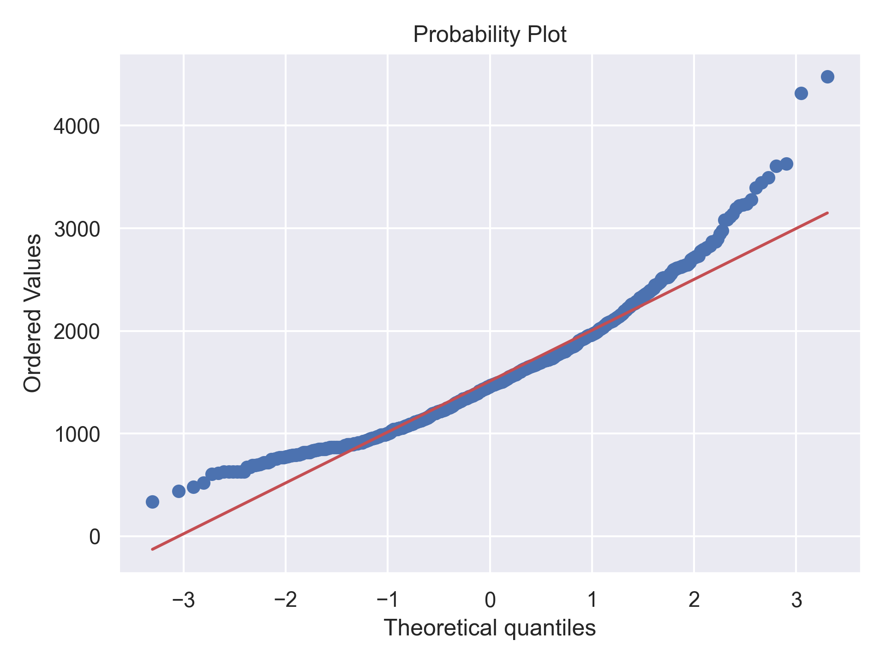
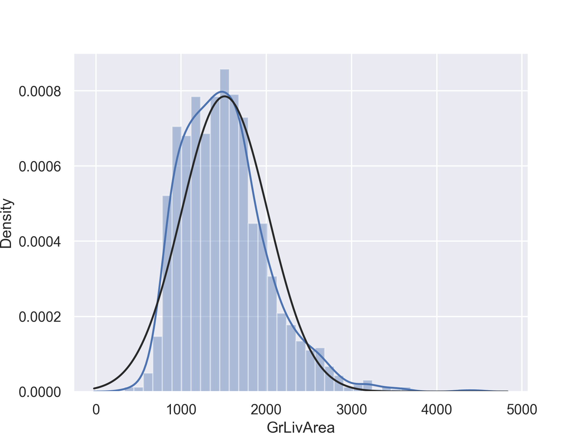

#### Es notable la curtosis, asi que repetimos el proceso


````python
# Transformación logarítmica
df_train['GrLivArea'] = np.log(df_train['GrLivArea'])

#transformed histogram and normal probability plot
sns.distplot(df_train['GrLivArea'], fit=norm);
fig = plt.figure()
res = stats.probplot(df_train['GrLivArea'], plot=plt)
plt.show()
````

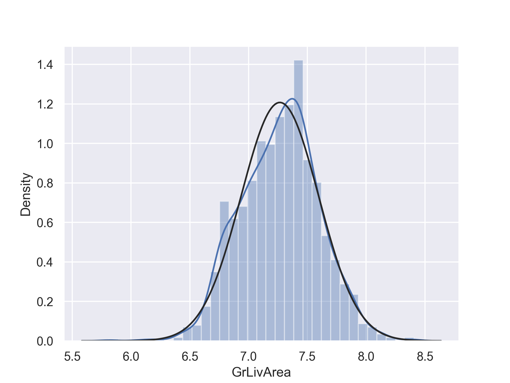
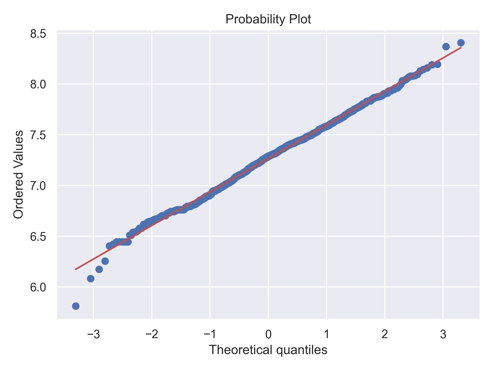

#### Seguimos...

````python
sns.distplot(df_train['TotalBsmtSF'], fit=norm);
fig = plt.figure()
res = stats.probplot(df_train['TotalBsmtSF'], plot=plt)
plt.show()
````


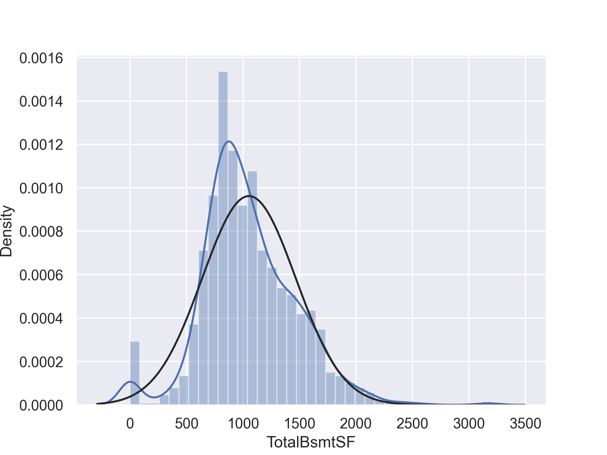
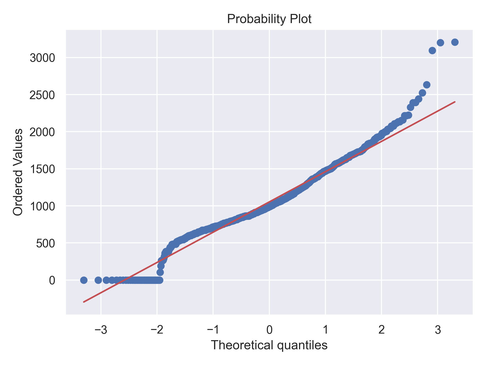


#### Observamos curtosis y también valores cero, que son casas sin sótano, un gran problema porque el valor cero no nos permite hacer transformaciones logarítmicas 

#### Para aplicar una transformación logarítmica aquí, crearemos una variable que pueda capturar el efecto de tener o no tener sótano (variable binaria). Luego, haremos una transformación logarítmica a todas las observaciones no cero, ignorando aquellas con valor cero. De esta manera, podemos transformar los datos, sin perder el efecto de tener o no tener sótano.


````python
#CREATE COLIM
df_train['HasBsmt'] = pd.Series(len(df_train['TotalBsmtSF']), index=df_train.index)
df_train['HasBsmt'] = 0 
df_train.loc[df_train['TotalBsmtSF']>0,'HasBsmt'] = 1
#transform data
df_train.loc[df_train['HasBsmt']==1,'TotalBsmtSF'] = np.log(df_train['TotalBsmtSF'])
#histogram and normal probability plot
sns.distplot(df_train[df_train['TotalBsmtSF']>0]['TotalBsmtSF'], fit=norm);
fig = plt.figure()
res = stats.probplot(df_train[df_train['TotalBsmtSF']>0]['TotalBsmtSF'], plot=plt)
plt.show()
````


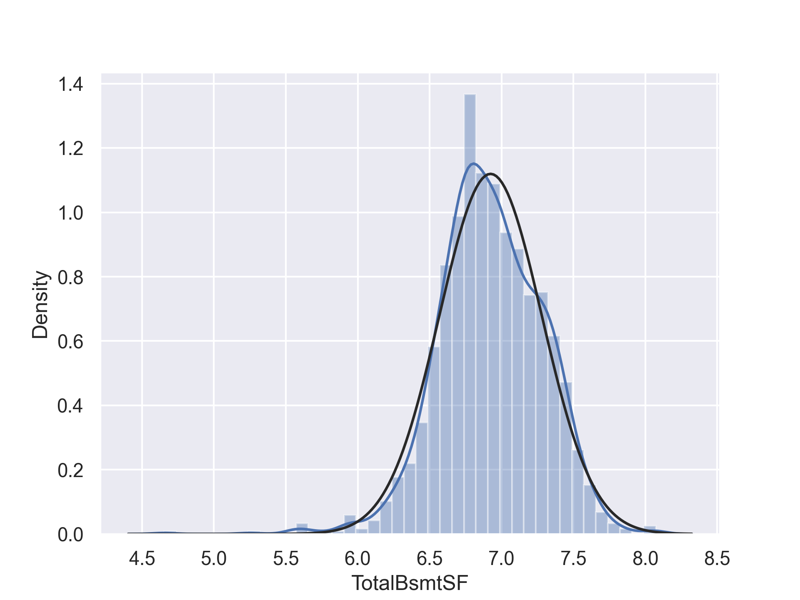
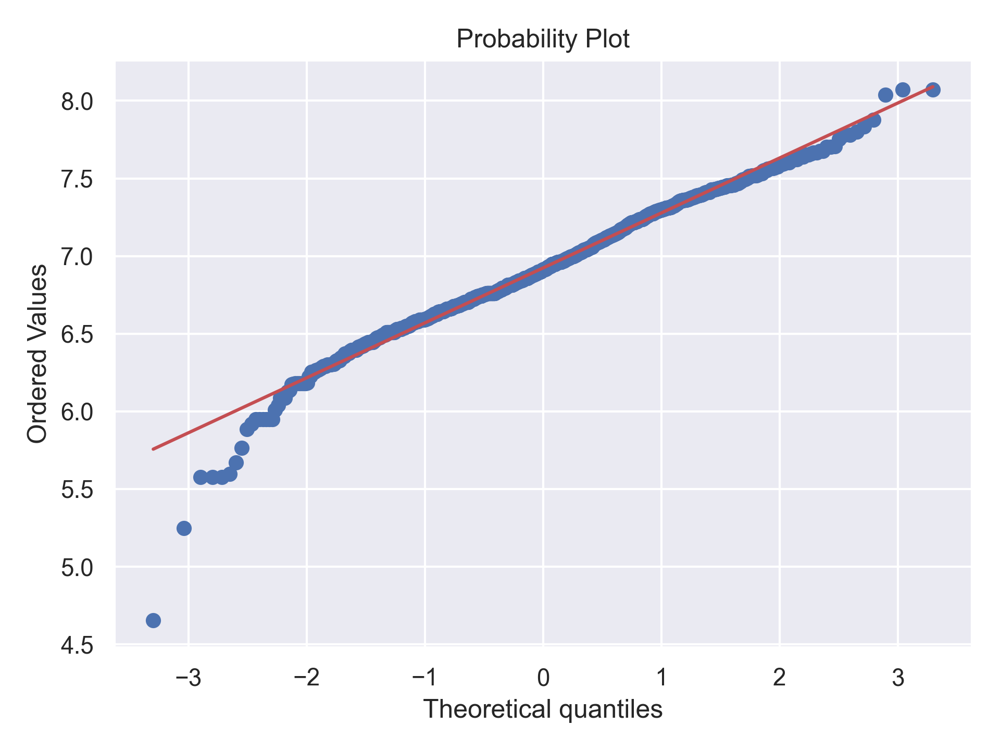


### En busca de la homoscedasticidad


#### Empezando por la variable del precio del venta y área habitable 

````python
#scatter plot
plt.scatter(df_train['GrLivArea'], df_train['SalePrice']);
plt.show()
````


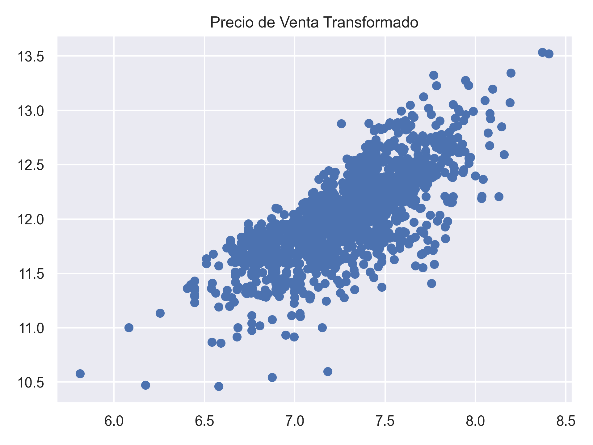


#### A simple vista podemos ver que el grafico actual ya no tiene una forma cónica como la versión previa a la transformacion logarítmica de este gráfico de dispersión.
#### Esto es gracias a asegurar la normalidad en las variables, así se comprueba la homoscedasticidad

#### Sigamos con la variable de precio de venta y área total del sótano
````python
#scatter plot
plt.scatter(df_train[df_train['TotalBsmtSF']>0]['TotalBsmtSF'], df_train[df_train['TotalBsmtSF']>0]['SalePrice']);
plt.show()
````

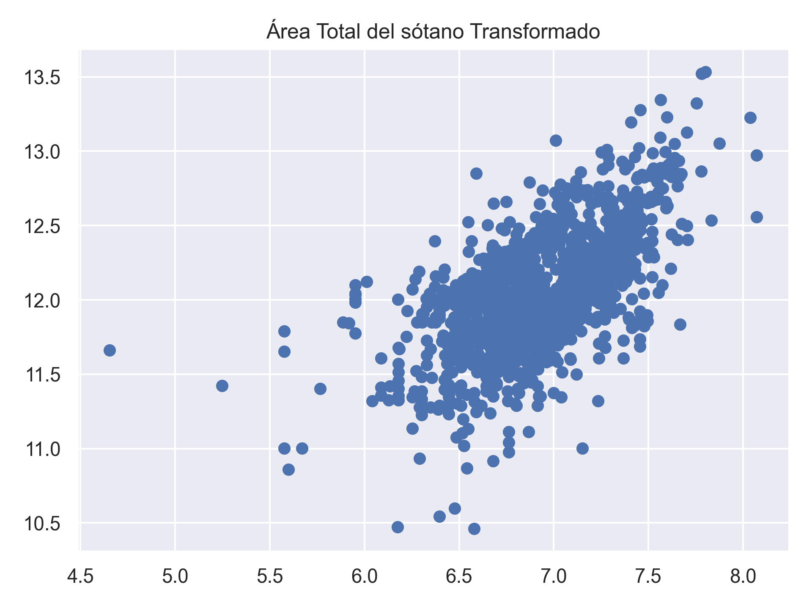


#### Podemos decir que, en general, 'SalePrice' exhibe niveles iguales de varianza a lo largo del rango de 'TotalBsmtSF'

### Último pero no menos importante, convertir las variables categóricas en variables ficticias. 

````python
df_train = pd.get_dummies(df_train)
````

### Proximamente, usaremos estos datos para predecir el precio de venta.